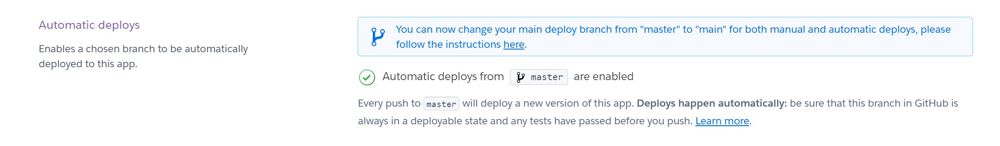

# Nus-money-backend

This was created to demonstrate automated deployment to github pages and heroku.

View app at https://cotldus.github.io/nus-moneyapp-frontend/

Dummy user:

    "username": "Anatole",
    "password": "WOfNDBm"
   
Other users: https://nus-moneyapp-backend.herokuapp.com/user/all

Frontend repo: https://github.com/cotldus/nus-moneyapp-frontend

Original app repo: https://github.com/cotldus/nus-moneyapp


See NUSmoneyapp.postman_collection.json for api details

## Heroku

Under "new" select "create app"


Save environment variables


Connect to git-hub


Deploy Branch to Heroku


Click on "Open app" at the top right-hand corner" and it should take you to your web page.
In my case, I did not provide a root route so I had to change it to https://nus-moneyapp-backend.herokuapp.com/user/all

Now your api is available!

## Automating deployments

### Option 1 

Create Procfile in your repository with code

`web: node main.js`

Enable automatic deploys to heroku. Heroku will pull from your github repo and install all dependencies.



### Option 2

Create deploy.yml file under .github/workflows with the following code. Github will deploy to heroku automatically

```
name: Deploy

on:
  push:
    branches:
      - master

jobs:
  build:
    runs-on: ubuntu-latest
    steps:
      - uses: actions/checkout@v2
      - uses: akhileshns/heroku-deploy@v3.12.12 # This is the action
        with:
          heroku_api_key: ${{secrets.HEROKU_API_KEY}}
          heroku_app_name: "nus-moneyapp-backend" #Must be unique in Heroku
          heroku_email: "steph1danielle@gmail.com
```
1. Change the above code to your heroku email.
2. Change the heroku_app
3. Store Heroku API Key in github secrets
    
Now go to your Heroku account and go to Account Settings. Scroll to the bottom until you see API Key. Copy this key and go to your project's repository on GitHub.


In your Repo, go to Settings -> Secrets and click on "New Secret". Then enter HEROKU_API_KEY as the name and paste the copied API Key as the value.


Make a change and go to github's action tab and you should see something like this: 


# Nus-moneyapp-frontend

[Frontend Repository](https://github.com/cotldus/nus-moneyapp-frontend)

Remember to change all root API endpoints from localhost to the backend API endpoint you just created on Heroku. 

For example, https://nus-moneyapp-backend.herokuapp.com

Proceed to the settings tab of your frontend github repository and click on pages. Choose the branch you want to publish your frontend website and click save.
Github will generate a website for you like this:


Any changes to cotldus/nus-moneyapp-frontend will now be updated on https://cotldus.github.io/nus-moneyapp-frontend/. It will take a couple of minutes for git to build and publish but it will be updated automatically.
